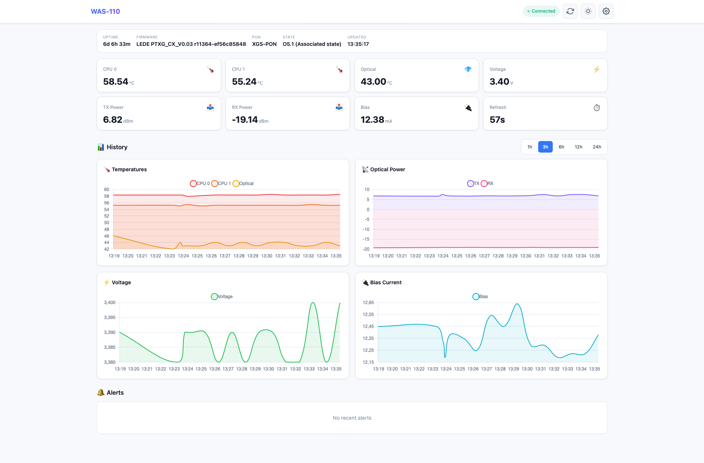

# WAS-110 SFP+ ONT Monitor

A modern, real-time monitoring webapp for WAS-110 SFP+ ONT modules with alerting and notifications.



## Features

- **Real-time Monitoring**: Live dashboard with WebSocket updates
- **Temperature Tracking**: CPU and optical module temperatures
- **Optical Metrics**: TX/RX power, bias current, supply voltage
- **System Info**: Uptime, firmware version, PON status, ONU state
- **Historical Data**: Up to 72 hours of history with interactive charts
- **Alerting System**: Configurable thresholds with warning/critical levels
- **Multiple Notification Channels**:
  - Gotify
  - Ntfy push notifications
  - Generic webhooks
  - Email (SMTP)
- **PWA Support**: Mobile-friendly, installable as app
- **Dark/Light Theme**: User preference with auto-save
- **Data Export**: Export history as JSON or CSV
- **Docker Ready**: Easy deployment with Docker

## Quick Start

### Using Docker Run

```bash
docker run -d \
  --name was-110-monitor \
  --restart unless-stopped \
  -p 5050:5050 \
  -v /path/to/data:/data \
  -e SFP_HOST=192.168.11.1 \
  -e SFP_PORT=22 \
  -e SFP_USER=root \
  -e SFP_ROOT_PASSWORD=your_password \
  ghcr.io/alanstrok/was-110-montior:latest
```

### Using Docker Compose (Recommended)

Create a `docker-compose.yml` file:

```yaml
version: '3.8'

services:
  was-110-monitor:
    image: ghcr.io/alanstrok/was-110-montior:latest
    container_name: was-110-monitor
    restart: unless-stopped
    ports:
      - "5050:5050"
    volumes:
      - ./data:/data
    environment:
      - SFP_HOST=192.168.11.1
      - SFP_PORT=22
      - SFP_USER=root
      - SFP_ROOT_PASSWORD=your_password
      # Optional settings
      - FETCH_INTERVAL_SECONDS=60
      - HISTORY_HOURS=72
      - TZ=America/New_York
```

Then run:

```bash
docker-compose up -d
```

Access the dashboard at `http://localhost:5050`

### Unraid Installation

1. Go to Docker tab
2. Add container with:
   - **Repository**: `ghcr.io/alanstrok/was-110-montior:latest`
   - **Port**: `5050:5050`
   - **Path**: `/mnt/user/appdata/was-110-monitor` → `/data`
   - **Variables**: `SFP_HOST`, `SFP_PORT`, `SFP_USER`, `SFP_ROOT_PASSWORD`

### Manual Installation

1. Install dependencies:
```bash
pip install -r requirements.txt
```

2. Set environment variables:
```bash
export SFP_ROOT_PASSWORD="your_password"
```

3. Run the application:
```bash
python app.py
```

## Configuration

### Environment Variables

| Variable | Default | Description |
|----------|---------|-------------|
| `SFP_HOST` | `192.168.11.1` | WAS-110 IP address |
| `SFP_PORT` | `22` | SSH port |
| `SFP_USER` | `root` | SSH username |
| `SFP_ROOT_PASSWORD` | - | SSH password (required) |
| `FETCH_INTERVAL_SECONDS` | `60` | Data collection interval |
| `HISTORY_HOURS` | `72` | Hours of history to keep |
| `TZ` | `UTC` | Timezone |
| `TEMP_WARNING` | `65` | CPU temp warning threshold (°C) |
| `TEMP_CRITICAL` | `75` | CPU temp critical threshold (°C) |
| `OPTICAL_TEMP_WARNING` | `55` | Optical temp warning (°C) |
| `OPTICAL_TEMP_CRITICAL` | `65` | Optical temp critical (°C) |
| `RX_POWER_WARNING` | `-25` | RX power warning (dBm) |
| `RX_POWER_CRITICAL` | `-28` | RX power critical (dBm) |

### Notifications

Notifications can be configured via the Settings page in the web UI, or via environment variables.

#### Gotify
```env
GOTIFY_URL=http://192.168.1.x:8080
GOTIFY_TOKEN=your_app_token
```

#### Ntfy
```env
NTFY_URL=https://ntfy.sh
NTFY_TOPIC=was110-alerts
```

#### Webhook
```env
WEBHOOK_URL=https://your-webhook-endpoint.com/notify
```

#### Email (SMTP)
```env
SMTP_HOST=smtp.gmail.com
SMTP_PORT=587
SMTP_USER=your_email@gmail.com
SMTP_PASSWORD=your_app_password
SMTP_FROM=your_email@gmail.com
SMTP_TO=alerts@example.com
```

## API Endpoints

| Endpoint | Method | Description |
|----------|--------|-------------|
| `/api/data` | GET | Current data and history |
| `/api/status` | GET | Connection status |
| `/api/alerts` | GET | Alert history |
| `/api/config` | GET | Current configuration |
| `/api/export` | GET | Export data (JSON/CSV) |
| `/api/refresh` | POST | Force data refresh |

### Export Examples

```bash
# Export last 24h as JSON
curl "http://localhost:5050/api/export?format=json&hours=24"

# Export last 6h as CSV
curl "http://localhost:5050/api/export?format=csv&hours=6" > data.csv
```

## Architecture

```
┌─────────────────┐     SSH      ┌─────────────┐
│   WAS-110 ONT   │◄────────────►│   Monitor   │
│  192.168.11.1   │              │   Backend   │
└─────────────────┘              └──────┬──────┘
                                        │
                                        │ WebSocket/REST
                                        │
                                 ┌──────▼──────┐
                                 │  Dashboard  │
                                 │  (Browser)  │
                                 └─────────────┘
```

## Metrics Collected

| Metric | Source | Unit |
|--------|--------|------|
| CPU 0 Temperature | `/sys/class/thermal/thermal_zone0/temp` | °C |
| CPU 1 Temperature | `/sys/class/thermal/thermal_zone1/temp` | °C |
| Optical Temperature | SFP EEPROM (A2, offset 96) | °C |
| Supply Voltage | `pontop -b -g 'Optical Interface Status'` | V |
| Bias Current | `pontop -b -g 'Optical Interface Status'` | mA |
| TX Power | `pontop -b -g 'Optical Interface Status'` | dBm |
| RX Power | `pontop -b -g 'Optical Interface Status'` | dBm |
| PON Mode | `pontop -b -g 'PON Status'` | - |
| ONU State | `pontop -b -g 'PON Status'` | - |

## Troubleshooting

### Connection Issues

1. Verify the WAS-110 is accessible:
```bash
ping 192.168.11.1
```

2. Test SSH connection:
```bash
ssh root@192.168.11.1
```

3. Check container logs:
```bash
docker-compose logs -f
```

### High Temperatures

WAS-110 modules are known to run hot. If temperatures consistently exceed 70°C:
- Ensure adequate ventilation
- Consider adding a heatsink
- Check ambient temperature

## Contributing

Contributions are welcome! Please open an issue or submit a pull request.


## Credits

Inspired by [mahmoudhamadeh/was-110-monitoring](https://github.com/mahmoudhamadeh/was-110-monitoring)
